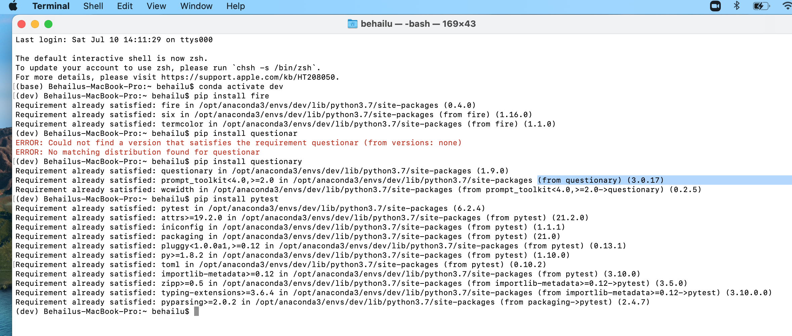
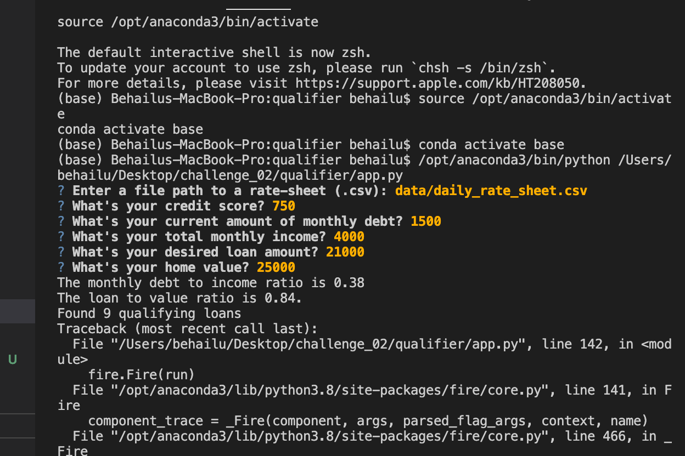
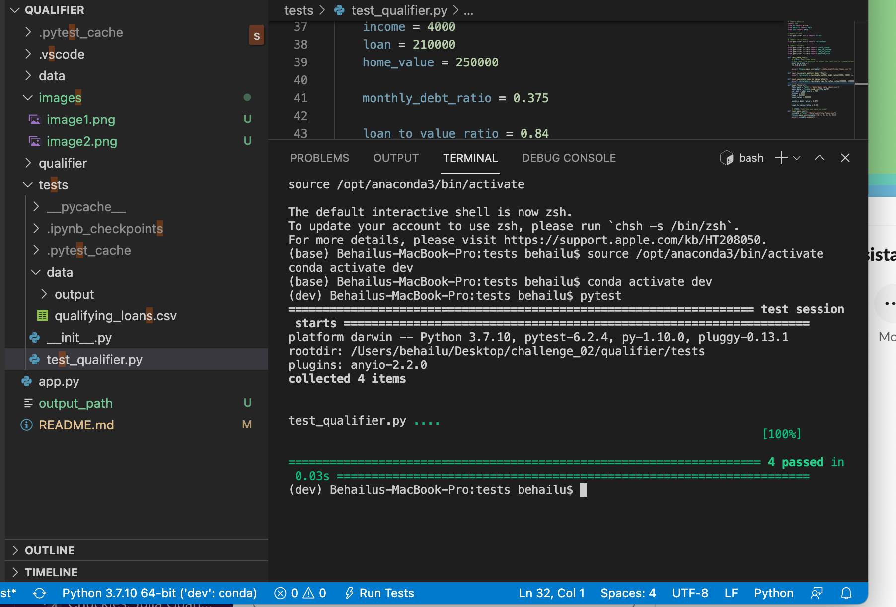

# Project Title:Loan qualifier

Just after the title, introduce your project by describing attractively what the project is about and what is the main problem that inspires you to create this project or what is the main contribution for the potential user of your project.
loan quailifier
It is the real truth of the world that most of us do not have enougn financial to buy whatever we desired, so that this project all about qualifying loans to get enough financial power to buy we what to buy. Based on monthly income, current monthly debt, credit score, loan amount and home value or item value , the loan qualifier will find banks or financial institutes which sort out qualifying loans available by linking to specific csv file. 
The main problem that inspire to me create this project is to filfull the way to find all available banks and financial istitutes to qualify for loans based their financial status which stated above.
The main contribution of the project for user is user will find out qualifying loans which eligible loans for the specified input and find out all available qualifying loans.

## Technologies

Describe the technologies required to use your project such as programming languages, libraries, frameworks, and operating systems. Be sure to include the specific versions of any critical dependencies that you have used in the stable version of your project.
The progrmming langauges used for this specific project is python 3.7.10('dev':conda) and operating system conda dev environment , while other CLI 

## Installation Guide

In this section, you should include detailed installation notes containing code blocks and screenshots.
open terminal for mac or gitbash for windows and install the followwing CLI.
conda activate dev
pip install fire
pip install questionary
pip install pytest

## Examples

This section should include screenshots, code blocks, or animations showing how your project works.

save_qualifying_loans = (qualifying_loans, "w")
    header = ("Lender","Max Loan Amount", "Max LTV", "Max DTI","Min Credit Score","Interest Rate")
    with open ('output_path', "w") as csv_file:
          csvwriter = csv.writer(csv_file, delimiter = " , ")
          csvwriter.writerow(header)
          for rows in qualifying_loans:
            csvwriter.writerow(rows)
            return rows

## Usage

This section should include screenshots, code blocks, or animations explaining how to use your project.

To use this project the above programming languages and data  should available;

## Contributors

In this section, list all the people who contribute to this project; since you may want to be reached by recruiters or potential collaborators, include your contact e-mail, and optionally your LinkedIn or Twitter profile.
Abiy T. Mekuria : abiym46.net@gmail.com or solebeli24@gmail.com
Khaled Karman: FinTech instructor
Venkata  :(TA)
Amanda Robinson :(TA)

## License

When you share a project on a repository, especially a public one, it's important to choose the right license to specify others what they can and can not do with your source code and files. Use this section to include the licence you want to use.
# License and copyright

Abiy T. Mekuria FinTech UCB Bootcomp
licensed under the [MIT license](license/License).